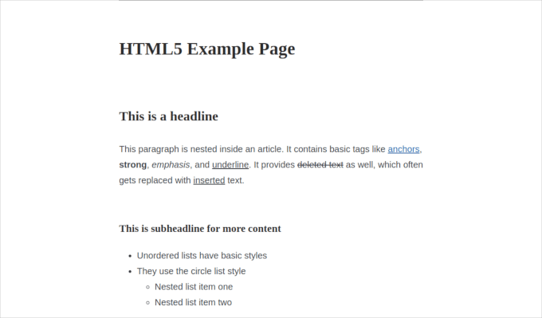

# Barebone Stylesheet

[](https://packagist.org/packages/pixelbrackets/barebone-stylesheet/)
[](https://www.npmjs.com/package/@pixelbrackets/barebone-stylesheet/)
[](https://spdx.org/licenses/GPL-2.0-or-later.html)

Barebone Stylesheet - Just enough CSS to look great everywhere.



_⭐ You like this package? Please star it or send a tweet. ⭐_

## Vision

This package provides a ready build stylesheet with *just enough styles*
to make a website look good everywhere.

It is based on the three terrific articles

- [58 bytes of CSS to look great nearly everywhere](https://gist.github.com/JoeyBurzynski/617fb6201335779f8424ad9528b72c41)
- [100 Bytes of CSS to look great everywhere](https://www.swyx.io/css-100-bytes)
- [Web Design in 4 minutes](https://jgthms.com/web-design-in-4-minutes/#share)

and aims to be one of the smallest stylesheets necessary to make *textual content* on
MVP webapps *readable and appealing*.

Default browser styles that look good enough will not be adjusted. More ambitious components
like cards, secondary buttons, gradients, grids, nested content or dark-mode themes
are not supported. If needed, then please use a CSS framework like
[Skeleton](https://getskeleton.com/) or [Bootstrap](https://getbootstrap.com) instead.

## Requirements

- None

## Installation

Download [manually](https://gitlab.com/pixelbrackets/barebone-stylesheet/-/raw/master/dist/barebone.css?inline=false)
or use a CDN like [jsDelivr](https://cdn.jsdelivr.net/gh/pixelbrackets/barebone-stylesheet/dist/barebone.min.css).

Packagist Entry https://packagist.org/packages/pixelbrackets/barebone-stylesheet/

NPM Entry https://www.npmjs.com/package/@pixelbrackets/barebone-stylesheet/

## Source

https://gitlab.com/pixelbrackets/barebone-stylesheet/

Mirror https://github.com/pixelbrackets/barebone-stylesheet/ (Issues & Pull Requests
mirrored to GitLab)

## Demo

🚀 https://barebone-stylesheet.app.pixelbrackets.de/

## Usage

Import the `barebone.css` file. That's it.

📦 A minified version, named `barebone.min.css`, is available as well.

💡 You may override the primary color, which is used for links and visual accents,
with a single CSS variable setting:

```html
<link rel="stylesheet" href="https://cdn.jsdelivr.net/gh/pixelbrackets/barebone-stylesheet/dist/barebone.min.css" />
<style>:root { --primary-color: purple; }</style>
```

📄 *Hint: To generate a minimal site with valid markup in no-time you may
want to take a look at the PHP packages
[pixelbrackets/html5-mini-template](https://packagist.org/packages/pixelbrackets/html5-mini-template)
and
[pixelbrackets/markdown-mini-page](https://packagist.org/packages/pixelbrackets/markdown-mini-page).*

## License

GNU General Public License version 2 or later

The GNU General Public License can be found at http://www.gnu.org/copyleft/gpl.html.

## Author

Dan Untenzu (<mail@pixelbrackets.de> / [@pixelbrackets](https://pixelbrackets.de))

## Changelog

See [CHANGELOG.md](./CHANGELOG.md)

## Contribution

This script is Open Source, so please use, share, patch, extend or fork it.

[Contributions](./CONTRIBUTING.md) are welcome!

## Feedback

Please send some [feedback](https://pixelbrackets.de/) and share how this
package has proven useful to you or how you may help to improve it.
